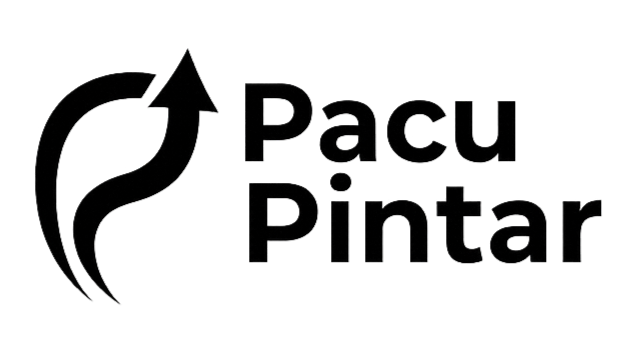

<div align="center">
  
  <picture>
    <source media="(prefers-color-scheme: dark)" srcset="PacuPintar_logo.png">
    <source media="(prefers-color-scheme: light)" srcset="PacuPintar_logo.png">
    
  </picture>
  
  <br/>

  ### **AI-Powered Learning Analytics Platform**
  
  *Memaksimalkan Potensi Belajar dengan Kecerdasan Buatan*
  
  [](https://pacupintar.netlify.app/)
  
  [](https://nextjs.org/)
  [](https://www.typescriptlang.org/)
  [](https://www.python.org/)
  [](https://hapi.dev/)
  [](https://fastapi.tiangolo.com/)
  
  <br/>
  
  [🌐 Live Demo](https://pacupintar.netlify.app/) • [Fitur](#-fitur-utama) • [Arsitektur](#-arsitektur-sistem) • [Instalasi](#-instalasi) • [Tim](#-our-team)

</div>

---

## 📖 Tentang Pacu Pintar

**Pacu Pintar** adalah platform analitik pembelajaran berbasis AI yang dirancang untuk membantu siswa mendapatkan saran belajar personal dan melacak kecepatan pembelajaran secara real-time.

Dengan menggabungkan **Machine Learning** dan **Generative AI**, Pacu Pintar memberikan insight yang actionable untuk meningkatkan efektivitas belajar setiap siswa.

### 🔗 Live Website
> **� Kunjungi website kami: [https://pacupintar.netlify.app/](https://pacupintar.netlify.app/)**

### �🎯 Masalah yang Diselesaikan

| Masalah | Solusi Pacu Pintar |
|---------|-------------------|
| ❌ Siswa butuh motivasi & saran personal | ✅ **AI-Generated Advice** - Saran personal menggunakan OpenRouter API |
| ❌ Siswa tidak tahu progress mereka | ✅ **Learning Pace Analysis** - Analisis kecepatan belajar real-time |

---

## ✨ Fitur Utama

<div align="center">

### 💬 Personalized AI Advice
</div>

Saran belajar personal menggunakan **OpenRouter API** yang:
- ✅ **Personal** - Menyapa dengan nama siswa
- ✅ **Empatik** - Memahami kondisi siswa
- ✅ **Context-aware** - Mempertimbangkan pace belajar
- ✅ **Actionable** - Saran yang bisa langsung diterapkan
- ✅ **Motivasional** - Mendorong semangat belajar

**Contoh Output:**
> *"Halo Budi Santoso! Kamu memiliki pace belajar yang cepat, ini menunjukkan kemampuan adaptasimu yang luar biasa! Kami sarankan untuk terus eksplorasi topik-topik advanced dan gunakan teknik pomodoro untuk fokus optimal. Terus semangat!"*

<div align="center">

### 📊 Learning Pace Analysis
</div>

Mengklasifikasikan kecepatan belajar menjadi **3 kategori** menggunakan **Random Forest Classifier**:

| Class | Label | Deskripsi | Kriteria |
|-------|-------|-----------|----------|
| 0 | 📊 **Consistent Learner** | Belajar teratur dan stabil | `weekly_cv` rendah |
| 1 | 🚀 **Fast Learner** | Belajar cepat dan efisien | `completion_speed < 0.55` |
| 2 | 📚 **Reflective Learner** | Belajar mendalam dan reflektif | `completion_speed > 1.5` |

**Output:**
- **Label:** Fast Learner / Consistent Learner / Reflective Learner
- **Confidence:** Tingkat kepercayaan prediksi
- **Insight:** "Kamu belajar dengan cepat dan efisien! 🚀"

---

## 🏗️ Arsitektur Sistem

```
┌────────────────────────────────────────────────────────────────────────────┐
│                              PACU PINTAR                                   │
├────────────────────────────────────────────────────────────────────────────┤
│                                                                            │
│    ┌──────────────────┐         ┌──────────────────┐                       │
│    │    Frontend      │         │     Backend      │                       │
│    │    (Next.js)     │────────▶│    (Hapi.js)     │                       │
│    │   TypeScript     │◀────────│    + Prisma      │                       │
│    └──────────────────┘         └────────┬─────────┘                       │
│                                          │                                 │
│                                 ┌────────┴────────┐                        │
│                                 │                 │                        │
│                                 ▼                 ▼                        │
│                        ┌──────────────┐  ┌──────────────────┐              │
│                        │  PostgreSQL  │  │     ML API       │              │
│                        │  (Database)  │  │    (FastAPI)     │              │
│                        └──────────────┘  └────────┬─────────┘              │
│                                                   │                        │
│                                                   ▼                        │
│                                          ┌──────────────────┐              │
│                                          │    ML Models     │              │
│                                          │ • Random Forest  │              │
│                                          │ • OpenRouter API │              │
│                                          └──────────────────┘              │
│                                                                            │
└────────────────────────────────────────────────────────────────────────────┘
```

---

## 🛠️ Tech Stack

### Frontend
| Technology | Purpose |
|------------|---------|
|  | React Framework (SSR & Routing) |
|  | Type-safe Development |
|  | Styling & UI |
|  | UI Component Library |

### Backend
| Technology | Purpose |
|------------|---------|
|  | Node.js Framework |
|  | ORM & Database |
|  | Authentication |

### Machine Learning
| Technology | Purpose |
|------------|---------|
|  | ML Development |
|  | ML API Server |
|  | Machine Learning |
|  | Generative AI API |

---

## 📁 Struktur Projek

```
📦 projek-fiks/
├── 📂 ai-learning-insight/           # Web Application
│   ├── 📂 frontend/                  # Next.js 15 + TypeScript
│   │   ├── 📂 src/
│   │   │   ├── 📂 app/              # App Router Pages
│   │   │   ├── 📂 components/       # Reusable UI Components
│   │   │   ├── 📂 hooks/            # Custom React Hooks
│   │   │   ├── 📂 lib/              # Utility Functions
│   │   │   └── 📂 types/            # TypeScript Types
│   │   └── 📄 package.json
│   │
│   └── 📂 server/                    # Hapi.js Backend
│       ├── 📂 prisma/               # Database Schema & Migrations
│       ├── 📂 src/                  # Server Source Code
│       └── 📄 package.json
│
├── 📂 ML/                            # Machine Learning Module
│   ├── 📂 data/                     # Datasets
│   │   ├── 📂 raw/                  # Raw data from database
│   │   ├── 📂 interim/              # Cleaned data
│   │   └── 📂 processed/            # Feature-engineered data
│   │
│   ├── 📂 models/                   # Trained ML Models (.pkl)
│   │   ├── 📄 pace_classifier.pkl   # ⭐ Pace Classification Model
│   │   └── 📄 ...
│   │
│   ├── 📂 notebooks/                # Jupyter Notebooks
│   │   ├── 📄 01_clean_individual_files.ipynb
│   │   ├── 📄 02_feature_engineering.ipynb
│   │   ├── 📄 03_model2_advice_generation.ipynb    # ⭐ Advice Generation
│   │   ├── 📄 04_model3_pace_analysis.ipynb
│   │   └── 📄 05_model3_pace_classification.ipynb  # ⭐ Pace Classification
│   │
│   ├── 📂 src/                      # ML Source Code
│   │   └── 📂 api/                  # FastAPI Server
│   │       ├── 📄 main.py
│   │       ├── 📄 schemas.py
│   │       └── 📄 services.py
│   │
│   ├── 📄 API_DOCUMENTATION.md
│   ├── 📄 BACKEND_INTEGRATION_NODEJS.md
│   └── 📄 README.md
│
└── 📂 .github/                       # GitHub Configuration
    └── 📂 profile/
        └── 📄 README.md              # This file!
```

---

## 🚀 Instalasi

### Prerequisites
- **Node.js** 18.x atau lebih tinggi
- **Python** 3.8 atau lebih tinggi
- **MySQL** 8.0 atau lebih tinggi
- **Git**

### 1️⃣ Clone Repository

```bash
git clone https://github.com/your-username/pacu-pintar.git
cd pacu-pintar
```

### 2️⃣ Setup Frontend

```bash
cd ai-learning-insight/frontend
npm install
npm run dev
```

Frontend akan berjalan di `http://localhost:3000`

### 3️⃣ Setup Backend

```bash
cd ai-learning-insight/server
npm install

# Setup database
npx prisma generate
npx prisma migrate dev

npm run dev
```

Backend akan berjalan di `http://localhost:5000`

### 4️⃣ Setup ML API

```bash
cd ML

# Create virtual environment
python -m venv .venv
.venv\Scripts\activate  # Windows
# source .venv/bin/activate  # Linux/Mac

# Install dependencies
pip install -r requirements.txt

# Setup Gemini API Key (optional)
copy .env.example .env
# Edit .env dan tambahkan GEMINI_API_KEY

# Run ML API
cd src/api
python main.py
```

ML API akan berjalan di `http://localhost:8000`

---

## 📊 ML Models

### Model Performance

| Model | Metrik | Score | Tipe |
|-------|--------|-------|------|
| 📊 Pace Classification | Accuracy | ~90% | Random Forest |
| 💬 Advice Generation | - | - | Gemini AI |

### API Endpoints

| Method | Endpoint | Description |
|--------|----------|-------------|
| `GET` | `/health` | Health check |
| `POST` | `/api/v1/advice/generate` | Generate saran AI |
| `POST` | `/api/v1/pace/analyze` | Analisis kecepatan belajar |
| `GET` | `/api/v1/insights/{user_id}` | Semua insight sekaligus |

📄 **Dokumentasi lengkap:** Lihat [ML/API_DOCUMENTATION.md](../../ML/API_DOCUMENTATION.md)

---

## 🧪 Testing

### ML API Test
```bash
cd ML
python src/test_api.py
```

Expected output:
```
✓ All tests passed!
```

### Frontend Test
```bash
cd ai-learning-insight/frontend
npm run lint
```

---

## 📷 Screenshots

<div align="center">

### 🌐 Live Demo Preview

Kunjungi website kami untuk melihat demo langsung:

[](https://pacupintar.netlify.app/)

</div>

---

## 👥 Our Team

<div align="center">

### Capstone Project Team

#### 🤖 Machine Learning Team
| Cohort ID | Name |
| --- | --- |
| M671D5Y0270 | Arif Maulana Insaf |
| M671D5Y2019 | Zidan Mubarak |

#### 💻 React & Backend Developer Team
| Cohort ID | Name |
| --- | --- |
| R671D5Y0636 | Feril Ferdian |
| R891D5Y1241 | Muhammad Fadhil Alwan |
| R209D5Y0292 | Aryansyah Yudha Wijaya |

</div>

---

## 📚 Documentation

| Document | Description |
|----------|-------------|
| [ML README](../../ML/README.md) | Dokumentasi lengkap Machine Learning |
| [API Documentation](../../ML/API_DOCUMENTATION.md) | Dokumentasi endpoint API |
| [Backend Integration Guide](../../ML/BACKEND_FEATURE_CALCULATION_GUIDE.md) | Panduan integrasi backend |
| [Node.js Integration](../../ML/BACKEND_INTEGRATION_NODEJS.md) | Contoh integrasi Express.js |

---

## 📝 Changelog

### v1.0.0 (December 2025)
- ✅ Initial release
- ✅ AI-powered Advice Generation dengan Gemini
- ✅ Learning Pace Classification dengan Random Forest
- ✅ Full-stack web application
- ✅ Deployed to Netlify

---

## 🤝 Contributing

Kontribusi selalu diterima! Silakan buat issue atau pull request.

1. Fork repository ini
2. Buat branch baru (`git checkout -b feature/AmazingFeature`)
3. Commit perubahan (`git commit -m 'Add some AmazingFeature'`)
4. Push ke branch (`git push origin feature/AmazingFeature`)
5. Buat Pull Request

---

## 📄 License

Distributed under the MIT License. See `LICENSE` for more information.

---

<div align="center">

### 🌟 Pacu Pintar - Memaksimalkan Potensi Belajar dengan AI

**🌐 [pacupintar.netlify.app](https://pacupintar.netlify.app/)**

**© 2025 - Capstone Project for ASAH Led by Accenture**

Made with ❤️ by Pacu Pintar Team

[⬆ Kembali ke Atas](#-pacu-pintar)

</div>
